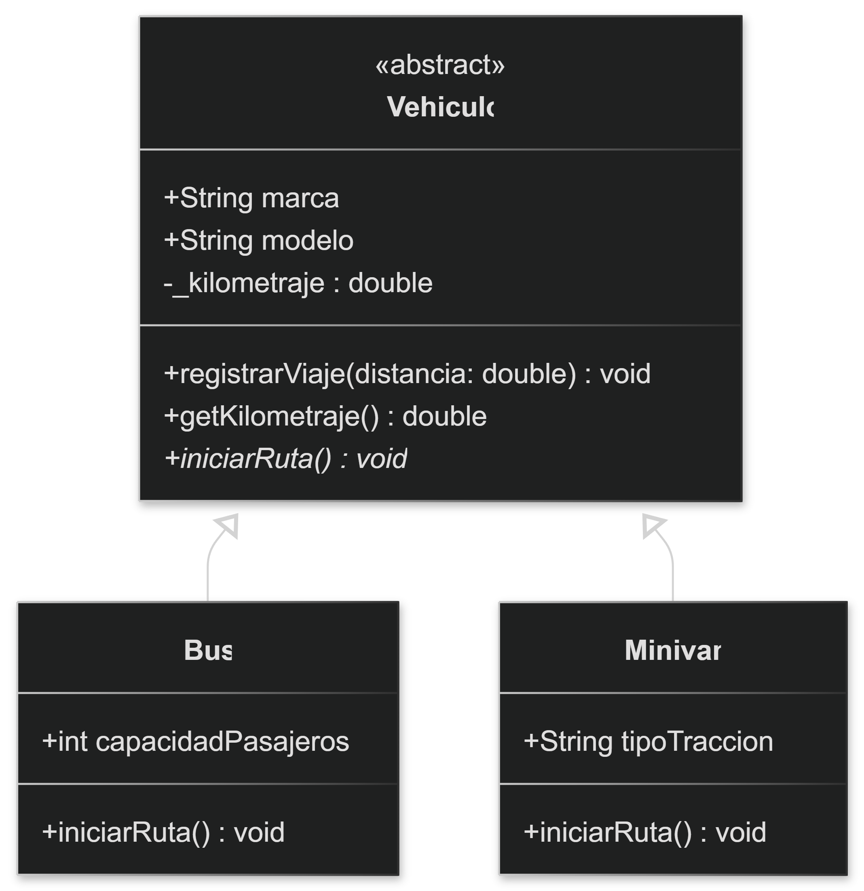
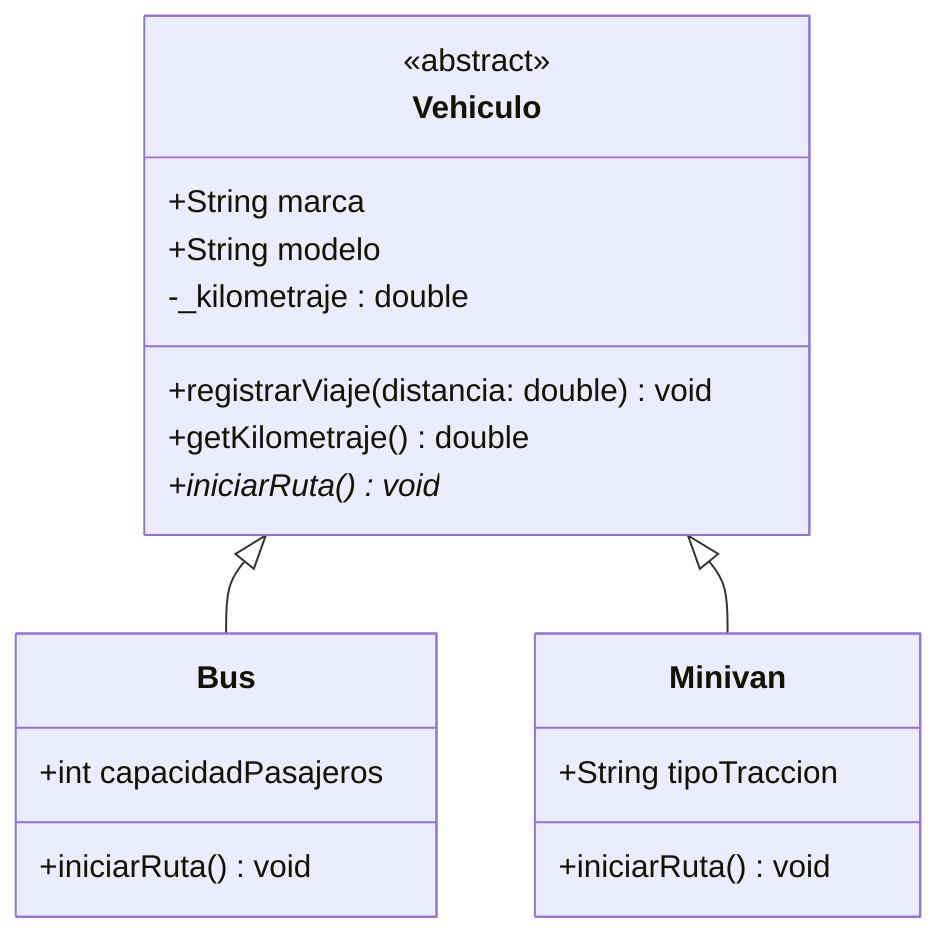

# Práctica de Laboratorio `1`: Sistema de Gestión de Flota de Transporte "Rutas"

#### Descargar las *INSTRUCCIONES DE LA PRÁCTICA* en `PDF`: [Práctica de laboratorio 1.pdf](../docs/PRAC_LAB_POO_1.pdf)

## Contexto
Una asociación de transporte requiere automatizar la gestión de su flota de vehículos. Para ello, se necesita desarrollar el núcleo de un sistema en Dart que modele el comportamiento de sus diferentes unidades de transporte, garantizando la seguridad de la información interna de cada vehículo y estandarizando las operaciones de ruta.

## Instrucciones
Desarrolle una solución en `Dart` aplicando los cuatro pilares de la [Programación Orientada a Objetos](poo.md), guiándose por el Diagrama de Clases UML adjunto. Su código debe cumplir con los siguientes requerimientos:

### Diagrama de Clases (UML)

<!-- <p align="center">  </p> -->



1.	***Abstracción:*** Defina el concepto general de un vehículo en el sistema. Este componente no debe poder instanciarse directamente, pero debe establecer la estructura base (marca y modelo) y definir la firma de la acción principal del sistema: `iniciarRuta()`.

2.	***Encapsulamiento:*** Proteja el estado interno de los vehículos. El kilometraje acumulado (`_kilometraje`) de cualquier unidad debe ser estrictamente privado. Su valor inicial será cero y solo podrá incrementarse a través de un método autorizado llamado `registrarViaje(double distancia)`. Proporcione una forma de leer este valor sin permitir su modificación directa.

3.	***Herencia:*** Modele al menos dos tipos específicos de unidades que pertenecen a la flota: `Bus` (que incluye el atributo `capacidadPasajeros`) y `Minivan` (que incluye el atributo `tipoTraccion`). Ambas unidades deben reutilizar la estructura y el comportamiento definidos en el concepto general de vehículo.

4.	***Polimorfismo:*** Implemente el comportamiento específico del método `iniciarRuta()` para cada tipo de unidad.

    *	Para el `Bus`, debe imprimir un mensaje indicando que inicia su ruta predeterminada con su capacidad máxima de pasajeros.

    *	Para la `Minivan`, debe imprimir un mensaje indicando que inicia un viaje exprés destacando su tipo de tracción.

5.	Finalmente, en la función `main()`, cree una lista que contenga objetos de ambos tipos y utilice un bucle para ejecutar el método `iniciarRuta()` en cada elemento, demostrando cómo el sistema responde dinámicamente según el tipo de objeto.

---

#### *A continuación, resolveremos el problema aplicando los cuatro pilares de la Programación Orientada a Objetos paso a paso.*

## Paso 1: Abstracción

**Objetivo:** Definir el concepto general de un vehículo que no pueda instanciarse directamente, estableciendo su estructura base (marca y modelo) y la firma de la acción principal `iniciarRuta()`.

**Solución en Dart:**

```dart
abstract class Vehiculo {
  // Estructura base solicitada
  String marca;
  String modelo;

  // Constructor para inicializar la marca y el modelo
  Vehiculo(this.marca, this.modelo);

  // Firma de la acción principal del sistema (Método abstracto)
  void iniciarRuta(); 
}
```

**Explicación:**
*   **`abstract class`**: Al agregar la palabra clave `abstract`, cumplimos con el requerimiento de que este componente "no debe poder instanciarse directamente". Es decir, nadie podrá hacer `Vehiculo miVehiculo = Vehiculo();`.
*   **Estructura base**: Declaramos `marca` y `modelo` como las propiedades fundamentales que todo vehículo en este sistema poseerá.
*   **Método abstracto**: Al escribir `void iniciarRuta();` sin abrir llaves `{ }`, estamos definiendo la "firma" del método. Estamos dictando qué debe poder hacer cualquier vehículo en el sistema, pero delegamos el cómo lo hace a las clases hijas que crearemos más adelante.

---

## Paso 2: Encapsulamiento

**Objetivo:** Proteger el estado interno de los vehículos. El kilometraje debe ser estrictamente privado, iniciar en cero, e incrementarse solo mediante el método `registrarViaje(double distancia)`. Se debe proporcionar una forma de leerlo sin modificarlo directamente.

**Solución en Dart:**
Actualizamos la clase `Vehiculo` del paso anterior:

```dart
abstract class Vehiculo {
  String marca;
  String modelo;
  
  // 1. Atributo privado: Se inicializa en cero y está protegido.
  double _kilometraje = 0.0;

  Vehiculo(this.marca, this.modelo);

  // 2. Método autorizado para modificar el estado interno.
  void registrarViaje(double distancia) {
    if (distancia > 0) { // Agregamos una pequeña validación lógica
      _kilometraje += distancia;
      print("Viaje de $distancia km registrado. Kilometraje actual: $_kilometraje km");
    } else {
      print("Error: La distancia del viaje debe ser mayor a cero.");
    }
  }

  // 3. Método para leer el valor sin permitir su modificación directa.
  double getKilometraje() {
    return _kilometraje;
  }

  // Método abstracto del paso anterior
  void iniciarRuta(); 
}
```

**Explicación:**
*   **La privacidad en Dart (`_`)**: A diferencia de lenguajes como Java o C# donde se usa la palabra `private`, en Dart el encapsulamiento se logra colocando un guion bajo (`_`) al principio del nombre de la variable (`_kilometraje`). Esto la hace privada a nivel de biblioteca (archivo).
*   **Protección del estado interno**: Gracias a que la variable es privada, desde fuera de la clase nadie puede hacer algo destructivo como `miVehiculo._kilometraje = -500;`.
*   **Métodos de acceso y mutación**: El método `getKilometraje()` actúa como un puente de solo lectura, permitiendo saber cuánto se ha recorrido sin alterar el odómetro. Por su parte, `registrarViaje` es la única "puerta" autorizada para modificar el kilometraje, permitiendo introducir reglas de negocio (como el `if (distancia > 0)`) para asegurar datos válidos.

---

## Paso 3: Herencia

**Objetivo:** Modelar dos tipos específicos de unidades (`Bus` con `capacidadPasajeros` y `Minivan` con `tipoTraccion`) que reutilicen la estructura y comportamiento del concepto general de vehículo.

**Solución en Dart:**

```dart
// Clase Bus que hereda de Vehiculo
class Bus extends Vehiculo {
  // Atributo específico de esta clase
  int capacidadPasajeros;

  // Constructor: Recibe los datos y pasa la marca y modelo a la clase padre usando 'super'
  Bus(String marca, String modelo, this.capacidadPasajeros) : super(marca, modelo);

  // Sobrescribimos el método abstracto (su comportamiento final lo veremos en el Paso 4)
  @override
  void iniciarRuta() {
    // Pendiente de implementar para el polimorfismo
  }
}

// Clase Minivan que hereda de Vehiculo
class Minivan extends Vehiculo {
  // Atributo específico de esta clase
  String tipoTraccion;

  // Constructor: Similar al Bus, envía datos a la clase padre
  Minivan(String marca, String modelo, this.tipoTraccion) : super(marca, modelo);

  // Sobrescribimos el método abstracto
  @override
  void iniciarRuta() {
    // Pendiente de implementar para el polimorfismo
  }
}
```

**Explicación:**
*   **La palabra clave `extends`**: Establece la relación de herencia en Dart. Al decir `class Bus extends Vehiculo`, indicamos que un Bus es un tipo de Vehículo y adquiere todo lo que este ya tiene.
*   **La función de `super`**: Cuando creamos un `Bus`, este necesita una marca y un modelo. Como esos atributos son administrados por la clase padre, usamos `super(marca, modelo)` para pasárselos al constructor de `Vehiculo` y que este los inicialice.
*   **Reutilización de código**: Ni en `Bus` ni en `Minivan` tuvimos que escribir la variable `_kilometraje` ni el método `registrarViaje()`; cualquier objeto de estas clases podrá usarlos como si fueran suyos.
*   **La obligación de `@override`**: Debido a que `Vehiculo` tiene un método abstracto, Dart nos obliga a incluirlo en las clases hijas. La etiqueta `@override` indica que estamos sobrescribiendo esa "firma" vacía para darle vida en la clase hija.

---

## Paso 4: Polimorfismo

**Objetivo:** Implementar el comportamiento específico del método `iniciarRuta()` para cada unidad, imprimiendo mensajes personalizados. Luego, en el `main()`, iterar sobre una lista de ambos objetos para demostrar cómo el sistema responde dinámicamente.

**Solución en Dart:**

```dart
// 1. Completamos el comportamiento del Bus
class Bus extends Vehiculo {
  int capacidadPasajeros;

  Bus(String marca, String modelo, this.capacidadPasajeros) : super(marca, modelo);

  @override
  void iniciarRuta() {
    print("El Bus $marca $modelo inicia su ruta predeterminada con una capacidad máxima de $capacidadPasajeros pasajeros.");
  }
}

// 2. Completamos el comportamiento de la Minivan
class Minivan extends Vehiculo {
  String tipoTraccion;

  Minivan(String marca, String modelo, this.tipoTraccion) : super(marca, modelo);

  @override
  void iniciarRuta() {
    print("La Minivan $marca $modelo inicia un viaje exprés destacando su tracción $tipoTraccion.");
  }
}

// 3. Ejecución del sistema demostrando el Polimorfismo
void main() {
  // Creamos una lista estrictamente de tipo "Vehiculo"
  List<Vehiculo> flotaRutas = [
    Bus("Volvo", "B430R", 45),
    Minivan("Toyota", "Hiace", "4x4")
  ];

  print("--- INICIANDO OPERACIONES DE LA FLOTA ---");

  // Recorremos la lista y ejecutamos la acción principal
  for (var unidad in flotaRutas) {
    // El sistema no sabe si es un Bus o una Minivan, solo sabe que es un Vehiculo
    // y que obligatoriamente tiene el método iniciarRuta()
    unidad.iniciarRuta(); 
    
    // También podemos probar el encapsulamiento y la herencia aquí:
    unidad.registrarViaje(150.5); 
    print("-" * 40);
  }
}
```

**Explicación:**
*   **¿Qué es el polimorfismo aquí?**: La palabra significa "muchas formas". El método `iniciarRuta()` toma diferentes formas dependiendo del objeto que lo ejecute (imprimiendo sobre pasajeros si es un Bus, o sobre tracción si es una Minivan).
*   **La magia del bucle `for`**: La lista `flotaRutas` es de tipo `Vehiculo`. El bucle toma cada unidad tratándola como un simple Vehículo y le da la orden de iniciar ruta.
*   **Decisión dinámica**: En tiempo de ejecución, Dart revisa qué es el objeto en realidad (un Bus o una Minivan) y usa la versión del método que le corresponde.
*   **Escalabilidad**: Si mañana la empresa compra un Taxi, solo tendrían que crear la clase `Taxi`, heredar de `Vehiculo` y sobrescribir su propio método; el bucle `for` en el `main()` no tendría que modificarse en absoluto.

---

>  [*DESCARGAR CÓDIGO COMPLETO DE LA SOLUCIÓN EN DART*](Ejemplo%201%20-%20POO%20con%20DART/)
