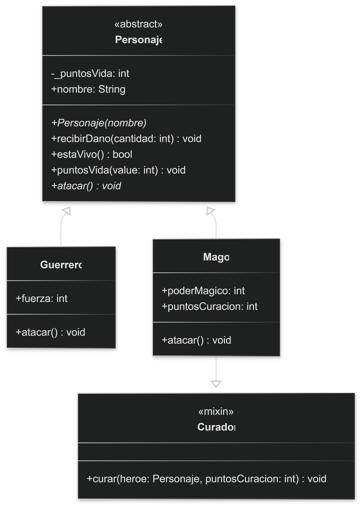
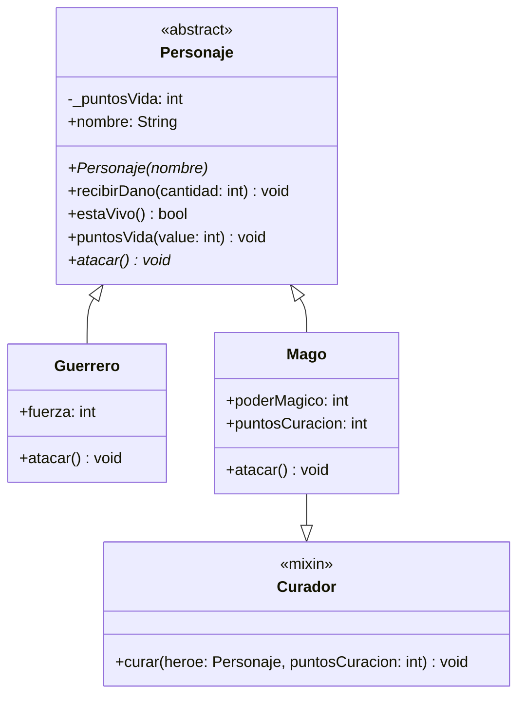

# Práctica de Laboratorio `2`: Sistema de Combate (Videojuego)

#### Descargar las *INSTRUCCIONES DE LA PRÁCTICA* en `PDF`: [Práctica de laboratorio 2.pdf](../docs/PRAC_LAB_POO_2.pdf)

## Contexto
Un estudio de desarrollo de videojuegos te ha contratado para programar el núcleo de su nuevo juego de rol. Necesitan un sistema que administre a los personajes del jugador, controle sus puntos de vida, ejecute sus ataques y utilice habilidades especiales.

## Instrucciones
Desarrolle una solución en Dart aplicando los 4 pilares de la POO, Mixins, Estructuras de Datos y Control de Flujo. Su código debe guiarse por el siguiente Diagrama de Clases UML y cumplir con los requerimientos descritos a continuación:

### Diagrama de Clases (UML)

<!-- <p align="center">  </p> -->



### Requerimientos del Sistema:
**1.	Abstracción y Encapsulamiento:** Crea la clase base Personaje. El atributo `_puntosVida` debe ser privado (iniciando en 100). Implementa métodos para reducir la vida (`recibirDano`) y verificar si el personaje sigue en pie (`estaVivo`). Define el método abstracto `atacar()`.

**2.	Mixins:** Crea un mixin llamado Curador que contenga un método `curar()` que imprima un mensaje indicando que el personaje emite un aura sanadora.

**3.	Herencia y Polimorfismo:** Crea las clases `Guerrero` y `Mago` que hereden de `Personaje`. El Mago debe adoptar el mixin `Curador`. Sobrescribe el método `atacar()` para que cada uno ataque a su manera.

***4.	SIMULACIÓN:*** En la función `main()`, crea una Lista (`List`) que contenga un equipo de personajes (Guerreros y Magos). Utiliza un bucle para recorrer el equipo. Usa condicionales (`if`) para verificar si el personaje es un Mago y, de ser así, hacer que use su habilidad curativa.

---

## 💻 Solución Paso a Paso

### Paso 1: Abstracción y Encapsulamiento (Archivo `game.dart`)

Definimos la plantilla principal `Personaje`. Protegemos los puntos de vida para que no puedan reducirse a números negativos e implementamos un *setter* especial que, en lugar de reemplazar la vida, le sumará puntos.

```dart
abstract class Personaje {
  int _puntosVida = 100; // Encapsulamiento: Variable privada
  String nombre;

  // Constructor con parámetro nombrado requerido
  Personaje({required this.nombre});

  void recibirDano({required int cantidad}) {
    _puntosVida -= cantidad;
    
    // Control de flujo para evitar vida negativa
    if (_puntosVida < 0) _puntosVida = 0; 

    print(
      "$nombre recibe $cantidad puntos de daño. Vida restante: $_puntosVida",
    );
  }

  bool estaVivo() {
    return _puntosVida > 0;
  }

  // Abstracción: Método que los hijos DEBEN implementar
  void atacar();

  // Setter: Modificado estratégicamente para sumar vida en lugar de sobrescribirla
  set puntosVida(int value) {
    _puntosVida += value;
  }
}
```

### Paso 2: El Mixin (Archivo `game.dart`)

Los Mixins permiten inyectar funcionalidades a las clases sin la limitante de la herencia tradicional.

```dart
mixin Curador {
  // Recibe al personaje a curar y la cantidad de puntos
  void curar(Personaje heroe, int puntosCuracion) {
    print("¡Curación! Restaurando puntos de vida...");
    heroe.puntosVida = puntosCuracion; // Llama al setter de la clase Personaje
  }
}
```

### Paso 3: Herencia y Polimorfismo (Archivo `gameInstance.dart`)

Creamos los tipos de personajes específicos que heredan del padre. Aquí vemos el **polimorfismo**: tanto el Guerrero como el Mago atacan, pero lo hacen imprimiendo mensajes distintos.

```dart
import 'game.dart';

class Guerrero extends Personaje {
  int fuerza;

  Guerrero({required String nombre, required this.fuerza})
    : super(nombre: nombre);

  @override
  void atacar() {
    print('''
      El guerrero $nombre ataca con su espada.
      Daño: $fuerza
    ''');
  }
}

class Mago extends Personaje with Curador {
  int poderMagico;
  int puntosCuracion;

  Mago({
    required String nombre,
    required this.poderMagico,
    required this.puntosCuracion,
  }) : super(nombre: nombre);

  @override
  void atacar() {
    print('''
      El Mago $nombre ataca lanzando una bola de fuego.
      Daño: $poderMagico
    ''');
  }
}
```

### Paso 4: Estructuras de Datos y Ejecución (Archivo `gameInstance.dart`)

En la función principal unimos todo, usando una lista para almacenar los objetos y bucles para la lógica del juego.

```dart
void main() {
  // 1. Estructura de Datos: Lista de la clase abstracta
  List<Personaje> equipo = [
    Guerrero(nombre: "Arthur", fuerza: 5),
    Mago(nombre: "Merlín", poderMagico: 4, puntosCuracion: 10),
    Guerrero(nombre: "Pancho", fuerza: 7),
  ];

  print("=== INICIA EL COMBATE ===");

  // 2. Control de Flujo: Iteramos sobre cada héroe
  for (var heroe in equipo) {
    if (heroe.estaVivo()) {
      heroe.atacar(); // Polimorfismo en ejecución

      // Verificación de tipo (Casting automático con 'is')
      if (heroe is Mago) {
        heroe.curar(heroe, heroe.puntosCuracion);
      }
    }
  }

  print("-" * 30);

  print("=== TURNO DEL ENEMIGO ===");

  // SIMULAMOS QUE UN ENEMIGO ATACA A PANCHO (índice 2 en la lista)
  equipo[2].recibirDano(cantidad: 6);

  // Operador ternario para imprimir el estado final
  print(
    "¿Pancho sigue vivo?\n${equipo[2].estaVivo() ? "Sí" : "No, murió en combate"}"
  );
}
```
---

>  [*DESCARGAR CÓDIGO COMPLETO DE LA SOLUCIÓN EN DART*](Ejemplo%202%20-%20POO%20con%20DART/)
