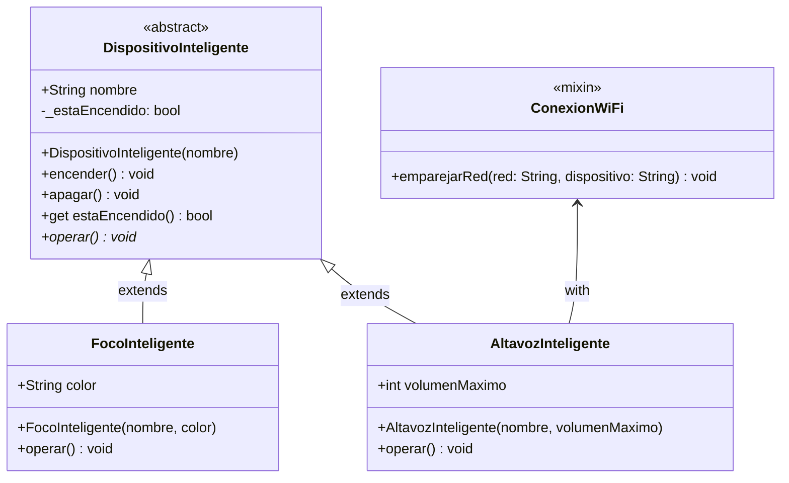

# Práctica de Laboratorio `3`: Sistema de Domótica (Casa Inteligente)

## Contexto
Una empresa de tecnología especializada en el "Internet de las Cosas" (IoT) te ha asignado el desarrollo del núcleo de su nueva aplicación móvil de domótica. Necesitan un sistema capaz de centralizar y controlar diferentes dispositivos del hogar, monitorear si están encendidos o apagados, y ejecutar las acciones específicas de cada aparato. Además, algunos dispositivos modernos requieren conectarse a la red WiFi, mientras que otros más simples no.

## Instrucciones
Desarrolle una solución en Dart aplicando los **4 pilares de la POO**, **Mixins**, **Estructuras de Datos** y **Control de Flujo**. Su código debe guiarse por el siguiente diagrama de clases y hacer uso estricto de **parámetros por nombre** (`required`) en los constructores y métodos.

### Diagrama de Clases UML (Mermaid)



---
## 💻 Solución Paso a Paso

### Paso 1: Creando la base (Abstracción y Encapsulamiento)

Para mantener nuestro proyecto ordenado, crearemos dos archivos. Primero, crea un archivo llamado `device_templates.dart`. 

Aquí definiremos la "plantilla" de cómo debe ser cualquier dispositivo inteligente. Usaremos **abstracción** para que nadie pueda crear un "dispositivo genérico" (siempre debe ser algo específico, como un foco) y **encapsulamiento** para proteger el estado de encendido/apagado, evitando que se modifique por accidente.

Escribe el siguiente código en tu archivo `device_templates.dart`:

```dart
// Archivo: device_templates.dart

abstract class DispositivoInteligente {
  String nombre;
  
  // Encapsulamiento: El guion bajo (_) hace que esta variable sea privada.
  // Nadie fuera de esta clase puede cambiarla directamente.
  bool _estaEncendido = false; 

  // Constructor exigiendo el nombre de forma obligatoria (required)
  DispositivoInteligente({required this.nombre});

  // Métodos controlados para cambiar el estado (Encapsulamiento)
  void encender() {
    _estaEncendido = true;
    print("[$nombre] ha sido ENCENDIDO.");
  }

  void apagar() {
    _estaEncendido = false;
    print("[$nombre] ha sido APAGADO.");
  }

  // Getter para que otros puedan "leer" si está encendido sin poder modificarlo
  bool get estaEncendido => _estaEncendido;

  // Abstracción: Obligamos a que cada hijo defina cómo funciona su propia operación
  void operar();
}
```

### Paso 2: Habilidades modulares con Mixins

No todos los aparatos de una casa se conectan a internet (por ejemplo, una lámpara bluetooth sencilla). Si pusiéramos el WiFi en la clase padre, obligaríamos a todos a tenerlo. Para resolver esto, usamos un **Mixin**, que es como un "paquete de habilidades" que podemos inyectar solo a los aparatos que lo necesiten.

Añade el siguiente código **al final de tu mismo archivo** `device_templates.dart`:

```dart
// (Continuación del archivo: device_templates.dart)

mixin ConexionWiFi {
  // Parámetros nombrados para mayor claridad al usar el método
  void emparejarRed({required String red, required String nombreDispositivo}) {
    print("[WiFi] El dispositivo '$nombreDispositivo' se emparejó exitosamente a la red: $red");
  }
}
```

### Paso 3: Construyendo los dispositivos reales (Herencia y Polimorfismo)

Ahora crea un **nuevo archivo** llamado `home_simulation.dart` en la misma carpeta.

Aquí crearemos los aparatos reales. Haremos un foco que solo hereda del padre, y un altavoz que, además de heredar, adopta nuestro mixin de WiFi. Nota cómo cada uno tiene su propia versión del método `operar()` (**Polimorfismo**).

Escribe lo siguiente en `home_simulation.dart`:

```dart
// Archivo: home_simulation.dart
import 'device_templates.dart';

// El foco es un dispositivo inteligente simple
class FocoInteligente extends DispositivoInteligente {
  String color;

  FocoInteligente({required String nombre, required this.color}) 
    : super(nombre: nombre);

  @override
  void operar() {
    print("El foco '$nombre' está iluminando la habitación en color $color.");
  }
}

// El altavoz es inteligente Y ADEMÁS tiene conexión WiFi (usando 'with')
class AltavozInteligente extends DispositivoInteligente with ConexionWiFi {
  int volumenMaximo;

  AltavozInteligente({required String nombre, required this.volumenMaximo}) 
    : super(nombre: nombre);

  @override
  void operar() {
    print("El altavoz '$nombre' está reproduciendo música a nivel $volumenMaximo.");
  }
}
```

### Paso 4: Dando vida a la Casa Inteligente (Estructuras de Datos y Control de Flujo)

Finalmente, vamos a probar que todo funciona. En tu **mismo archivo** `home_simulation.dart`, justo debajo de las clases que acabas de crear, agregaremos la función `main()`.

Crearemos una lista (nuestra estructura de datos) para guardar toda la casa. Luego, usaremos un bucle `for` para encender todo automáticamente, y la palabra clave `is` para detectar cuáles dispositivos necesitan conectarse al WiFi antes de empezar a funcionar.

Añade este bloque final a tu archivo:

```dart
// (Continuación del archivo: home_simulation.dart)

void main() {
  // Guardamos distintos tipos de hijos en una lista del tipo Padre
  List<DispositivoInteligente> miCasa = [
    FocoInteligente(nombre: "Luz Sala Principal", color: "Blanco Cálido"),
    AltavozInteligente(nombre: "Alexa Cocina", volumenMaximo: 80),
    FocoInteligente(nombre: "Lámpara de Noche", color: "Azul Tenue"),
  ];

  print("=== INICIANDO RUTINA DE BUENAS NOCHES ===");

  // Recorremos cada aparato de la casa
  for (var dispositivo in miCasa) {
    
    // 1. Encendemos el dispositivo
    dispositivo.encender();

    // 2. Control de Flujo: ¿Este aparato tiene WiFi?
    if (dispositivo is AltavozInteligente) {
      // Dart ya sabe que es un altavoz, así que nos deja usar el método del Mixin
      dispositivo.emparejarRed(
        red: "Familia_Perez_5G", 
        nombreDispositivo: dispositivo.nombre
      );
    }

    // 3. Polimorfismo: Si está encendido, que haga su trabajo
    if (dispositivo.estaEncendido) {
      dispositivo.operar();
    }
    
    print("-" * 40);
  }

  print("=== APAGANDO LA CASA ===");
  // Podemos acceder a un dispositivo específico de la lista para apagarlo
  miCasa[0].apagar();
}
```

---

### 📂 Archivos de Código (Solución Final)

>  [*DESCARGAR CÓDIGO COMPLETO DE LA SOLUCIÓN EN DART*](Ejemplo%203%20-%20POO%20con%20DART/)
