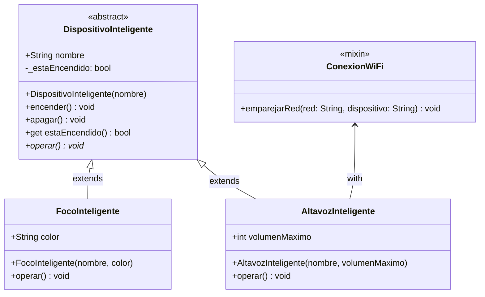

# Práctica de Laboratorio `3`: Sistema de Domótica (Casa Inteligente)

## CONTEXTO:
Una empresa de tecnología especializada en el "Internet de las Cosas" (IoT) te ha asignado el desarrollo del núcleo de su nueva aplicación móvil de domótica. Necesitan un sistema capaz de centralizar y controlar diferentes dispositivos del hogar, monitorear si están encendidos o apagados, y ejecutar las acciones específicas de cada aparato. Además, algunos dispositivos modernos requieren conectarse a la red WiFi, mientras que otros más simples no.

## 📝 Instrucciones
Desarrolle una solución en Dart aplicando los **4 pilares de la POO**, **Mixins**, **Estructuras de Datos** y **Control de Flujo**. Su código debe guiarse por el siguiente diagrama de clases y hacer uso estricto de **parámetros nombrados** (`required`) en los constructores y métodos.

### Diagrama de Clases UML (Mermaid)



---

## 💻 Solución Paso a Paso (Explicación para el Laboratorio)

### 1. Plantillas y Abstracción
El sistema requiere una clase base llamada `DispositivoInteligente`. Esta clase centraliza el estado (encendido/apagado) usando **Encapsulamiento** (la variable `_estaEncendido` es privada) y nos expone métodos públicos seguros (`encender`, `apagar`) y un `getter` para conocer su estado sin modificarlo directamente. Además, obliga mediante **Abstracción** a que cada dispositivo sepa cómo `operar()`.

### 2. El Mixin (Capacidades modulares)
No todos los dispositivos inteligentes tienen WiFi (por ejemplo, un foco Bluetooth básico). Por ende, en lugar de poner el WiFi en la clase padre, creamos el `mixin ConexionWiFi`. Esto nos permite "inyectar" esta capacidad solo a los dispositivos que la requieran.

### 3. Herencia y Polimorfismo
Creamos el `FocoInteligente` y el `AltavozInteligente`. Ambos heredan del padre, pero solo el altavoz utiliza el mixin (`with ConexionWiFi`). Cada uno sobrescribe el método `operar()` para hacer su tarea específica (**Polimorfismo**).

### 4. Simulación (Estructuras de Datos y Control de Flujo)
En nuestro `main()`, agrupamos toda la casa en una **Lista**. Usamos un **bucle for** para encender toda la casa de un solo golpe. Usando **condicionales** y la palabra clave `is`, verificamos si el aparato actual es un Altavoz para conectarlo al WiFi antes de ponerlo a operar.

---

## 📂 Archivos de Código (Solución Final)

A continuación, la solución separada en dos archivos para mantener las buenas prácticas de modularidad.

### Archivo 1: `device_templates.dart`
*(Este archivo contiene las abstracciones, el encapsulamiento y los mixins).*

```dart
// device_templates.dart

abstract class DispositivoInteligente {
  String nombre;
  
  // Encapsulamiento: El estado de encendido es privado
  bool _estaEncendido = false; 

  // Constructor con parámetros nombrados requeridos
  DispositivoInteligente({required this.nombre});

  // Métodos seguros para alterar el estado interno
  void encender() {
    _estaEncendido = true;
    print("[$nombre] ha sido ENCENDIDO.");
  }

  void apagar() {
    _estaEncendido = false;
    print("[$nombre] ha sido APAGADO.");
  }

  // Getter para leer el estado sin poder modificarlo directamente
  bool get estaEncendido => _estaEncendido;

  // Abstracción: Firma del método obligatorio
  void operar();
}

mixin ConexionWiFi {
  // Método del mixin usando parámetros nombrados
  void emparejarRed({required String red, required String nombreDispositivo}) {
    print("📡 [WiFi] El dispositivo '$nombreDispositivo' se emparejó exitosamente a la red: $red");
  }
}
```

### Archivo 2: `home_simulation.dart`
*(Este archivo contiene las clases hijas, la instanciación de objetos y la lógica principal).*

```dart
// home_simulation.dart
import 'device_templates.dart';

// Herencia simple
class FocoInteligente extends DispositivoInteligente {
  String color;

  FocoInteligente({required String nombre, required this.color}) 
    : super(nombre: nombre);

  @override
  void operar() {
    print("💡 El foco '$nombre' está iluminando la habitación en color $color.");
  }
}

// Herencia + Mixin
class AltavozInteligente extends DispositivoInteligente with ConexionWiFi {
  int volumenMaximo;

  AltavozInteligente({required String nombre, required this.volumenMaximo}) 
    : super(nombre: nombre);

  @override
  void operar() {
    print("🎵 El altavoz '$nombre' está reproduciendo música a nivel $volumenMaximo.");
  }
}

void main() {
  // 1. Estructura de Datos: Lista polimórfica de dispositivos
  List<DispositivoInteligente> miCasa = [
    FocoInteligente(nombre: "Luz Sala Principal", color: "Blanco Cálido"),
    AltavozInteligente(nombre: "Alexa Cocina", volumenMaximo: 80),
    FocoInteligente(nombre: "Lámpara de Noche", color: "Azul Tenue"),
  ];

  print("=== INICIANDO RUTINA DE BUENAS NOCHES ===");

  // 2. Control de Flujo: Recorriendo la lista
  for (var dispositivo in miCasa) {
    
    // Encendemos todos los dispositivos genéricamente
    dispositivo.encender();

    // Verificación de tipo y uso del Mixin
    if (dispositivo is AltavozInteligente) {
      // Como Dart sabe que es un AltavozInteligente, tenemos acceso al método del mixin
      dispositivo.emparejarRed(
        red: "Familia_Perez_5G", 
        nombreDispositivo: dispositivo.nombre
      );
    }

    // Polimorfismo: Cada quien opera a su manera, solo si está encendido
    if (dispositivo.estaEncendido) {
      dispositivo.operar();
    }
    
    print("-" * 40);
  }

  print("=== APAGANDO LA CASA ===");
  // Simulación de apagar un solo dispositivo específico
  miCasa[0].apagar();
}
```

---

¡Listo! Este formato con **Mermaid** se verá súper limpio y profesional cuando lo subas a tu repositorio de GitHub, y el ejercicio de la Casa Inteligente es muy intuitivo para explicar por qué algunos objetos necesitan WiFi y otros no (la magia de los Mixins). ¿Qué te parece este nuevo planteamiento?
