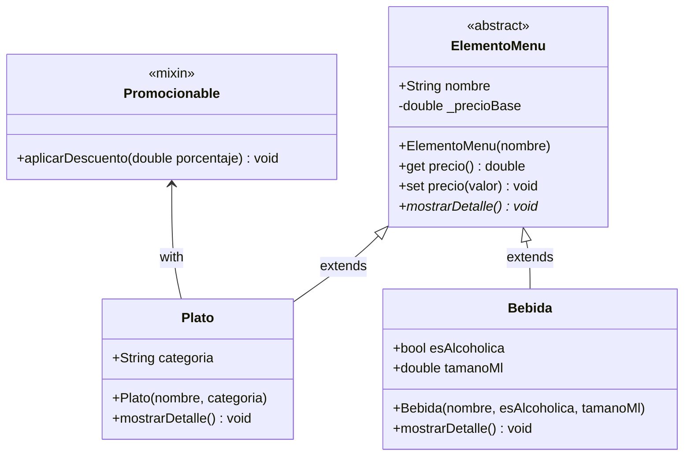

# Práctica de Laboratorio `4`: Sistema de Menú de Restaurante Digital

## Contexto
Un restaurante de alta cocina desea digitalizar su menú. Necesitan un sistema que gestione diferentes tipos de elementos (Platos y Bebidas). El sistema debe permitir ver los detalles de cada producto y calcular precios. Además, el restaurante ofrece "Días de Promoción" donde solo ciertos elementos seleccionados pueden recibir un descuento extra sobre su precio base.

## Instrucciones
Desarrolle una solución en Dart aplicando los **4 pilares de la POO**, **Mixins**, **Estructuras de Datos** y **Control de Flujo**. Su código debe guiarse por el siguiente diagrama de clases y hacer uso estricto de **parámetros por nombre** (`required`) en los constructores y métodos.

### Diagrama de Clases UML (Mermaid)



---

## 💻 Solución paso a paso

### Paso 1: Creando las bases (Abstracción y Encapsulamiento)

Primero, crearemos el archivo `menu_templates.dart`. Definiremos la clase abstracta `ElementoMenu`. Protegeremos el precio con un guion bajo (`_precioBase`) para que nadie lo modifique sin pasar por nuestras reglas, y usaremos un **Setter** para permitir ajustes de precio de forma controlada.

Escribe lo siguiente en `menu_templates.dart`:

```dart
// Archivo: menu_templates.dart

abstract class ElementoMenu {
  String nombre;
  
  // Encapsulamiento: El precio base es privado.
  double _precioBase = 0.0;

  // Constructor con parámetros nombrados requeridos
  ElementoMenu({required this.nombre});

  // Getter para obtener el precio actual
  double get precio => _precioBase;

  // Setter para asignar o modificar el precio (Encapsulamiento)
  set precio(double valor) {
    if (valor >= 0) {
      _precioBase = valor;
    } else {
      print("Error: El precio no puede ser negativo.");
    }
  }

  // Abstracción: Método que define la acción, pero no el "cómo"
  void mostrarDetalle();
}
```

### Paso 2: Habilidades especiales con Mixins

En el mismo archivo `menu_templates.dart`, agregaremos un **Mixin**. Esto nos permitirá que ciertos elementos del menú (como los platos fuertes) tengan la capacidad de recibir descuentos, mientras que otros (como las bebidas importadas) mantengan su precio fijo.

Añade este código al final de `menu_templates.dart`:

```dart
// (Continuación del archivo: menu_templates.dart)

mixin Promocionable {
  // Método para aplicar un descuento dinámico al precio base
  void aplicarDescuento(ElementoMenu item, double porcentaje) {
    double descuento = item.precio * (porcentaje / 100);
    item.precio = item.precio - descuento; 
    print("¡Promoción aplicada a '${item.nombre}'! Nuevo precio: \$${item.precio}");
  }
}
```

### Paso 3: Especialización de productos (Herencia y Polimorfismo)

Ahora crea el archivo `restaurant_app.dart`. Aquí definiremos los tipos de productos reales. Nota cómo el `Plato` utiliza el mixin `Promocionable`, pero la `Bebida` no. Ambos implementan su propia versión de `mostrarDetalle` (**Polimorfismo**).

Escribe esto en `restaurant_app.dart`:

```dart
// Archivo: restaurant_app.dart
import 'menu_templates.dart';

// El Plato hereda de ElementoMenu y es Promocionable
class Plato extends ElementoMenu with Promocionable {
  String categoria; // Ej: Entrada, Fuerte, Postre

  Plato({required String nombre, required this.categoria}) 
    : super(nombre: nombre);

  @override
  void mostrarDetalle() {
    print("PLATO: $nombre | Categoría: $categoria | Precio: \$${precio}");
  }
}

// La Bebida es un ElementoMenu simple (sin mixin)
class Bebida extends ElementoMenu {
  bool esAlcoholica;
  double tamanoMl;

  Bebida({
    required String nombre, 
    required this.esAlcoholica, 
    required this.tamanoMl
  }) : super(nombre: nombre);

  @override
  void mostrarDetalle() {
    String tipo = esAlcoholica ? "Alcohólica" : "Sin Alcohol";
    print("BEBIDA: $nombre | Tipo: $tipo | Tamaño: ${tamanoMl}ml | Precio: \$${precio}");
  }
}
```

### Paso 4: Simulación del Menú (Estructuras de Datos y Control de Flujo)

Finalmente, daremos vida al sistema en el `main`. Crearemos una **Lista** con nuestro inventario inicial y usaremos un bucle para procesar el menú. Si es un día de promoción, aplicaremos descuentos solo a los platos usando la palabra clave `is`.

Añade este bloque final a tu archivo `restaurant_app.dart`:

```dart
// (Continuación del archivo: restaurant_app.dart)

void main() {
  // 1. Estructura de Datos: Lista polimórfica de elementos del menú
  List<ElementoMenu> miMenu = [
    Plato(nombre: "Lasaña Boloñesa", categoria: "Fuerte"),
    Bebida(nombre: "Limonada Imperial", esAlcoholica: false, tamanoMl: 500),
    Plato(nombre: "Ceviche de Cámara", categoria: "Entrada"),
    Bebida(nombre: "Vino Tinto Reserva", esAlcoholica: true, tamanoMl: 150),
  ];

  // Asignamos precios iniciales usando el setter
  miMenu[0].precio = 15.50;
  miMenu[1].precio = 3.00;
  miMenu[2].precio = 12.00;
  miMenu[3].precio = 25.00;

  print("=== MENÚ DIGITAL DEL DÍA ===");

  // 2. Control de Flujo: Recorremos la lista
  for (var item in miMenu) {
    
    // Verificamos si el item es apto para promociones
    if (item is Promocionable) {
      // Aplicamos un 10% de descuento solo a los platos
      item.aplicarDescuento(item, 10);
    }

    // Polimorfismo: Cada objeto sabe cómo mostrar su detalle
    item.mostrarDetalle();
    
    print("-" * 45);
  }

  // 3. Verificación final de estado con Operador Ternario
  print("Estado del sistema: ${miMenu.isNotEmpty ? 'Menú cargado correctamente' : 'Error: Menú vacío'}");
}
```
---

### 📂 Archivos de Código (Solución Final)

>  [*DESCARGAR CÓDIGO COMPLETO DE LA SOLUCIÓN EN DART*](Ejemplo%204%20-%20POO%20con%20DART/)
