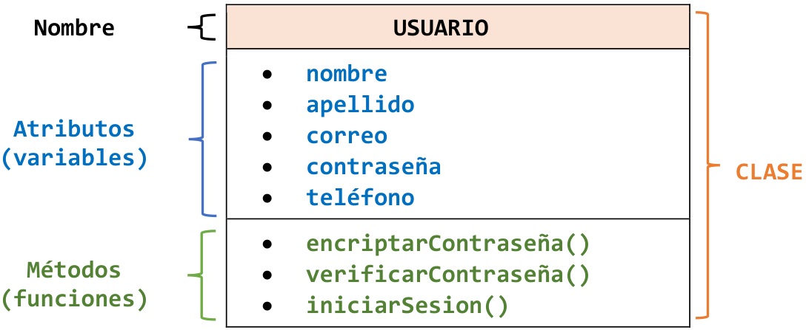
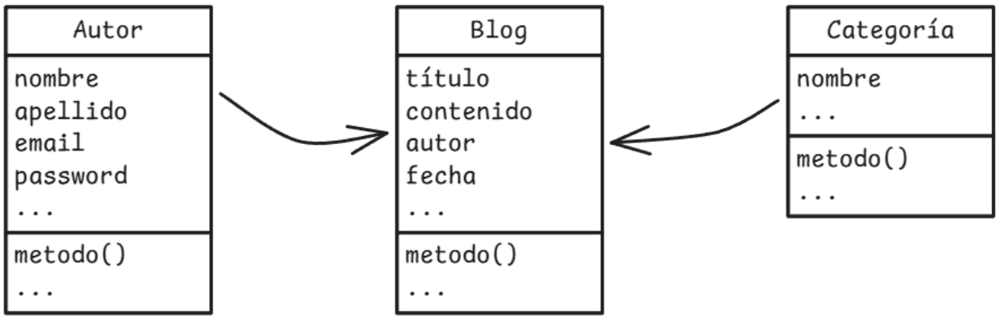
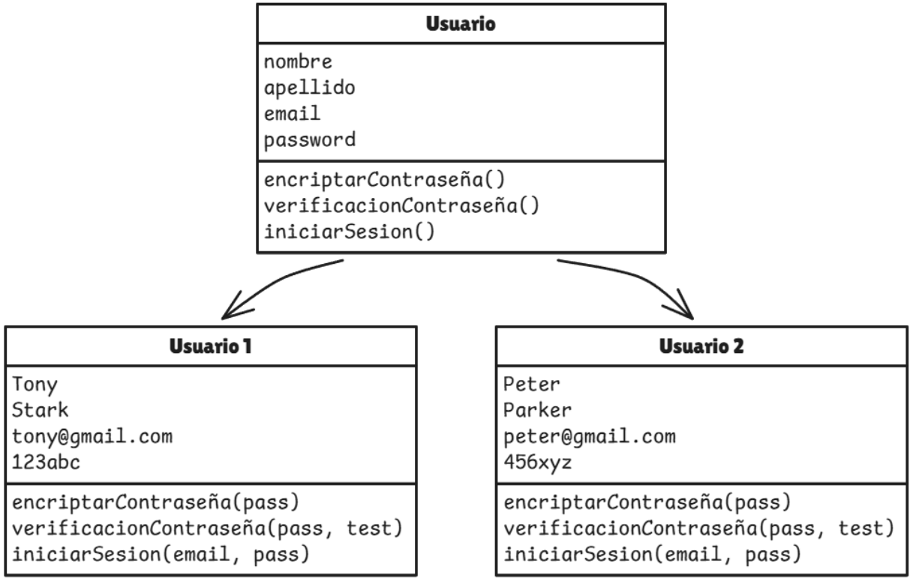
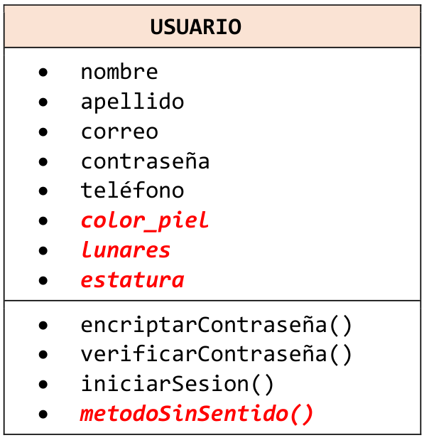
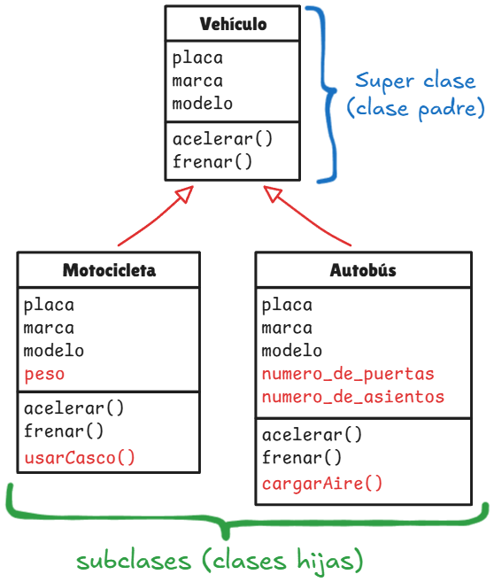
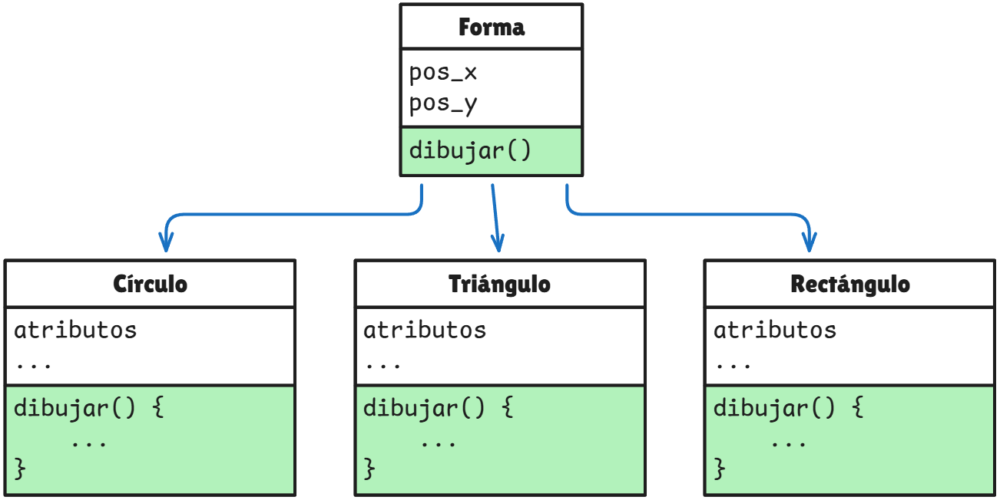
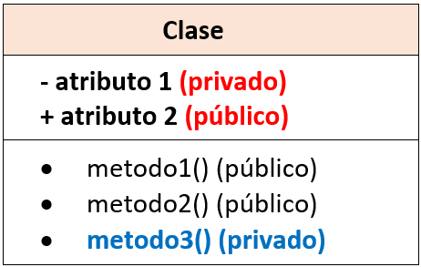
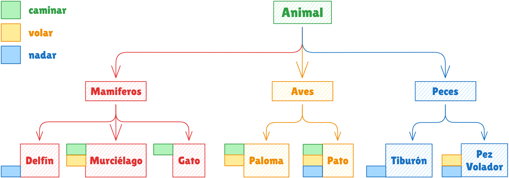

<p align="center"> <h1 align="center"> Programación Orientada a Objetos (POO) </h1> </p>

  * [**Abstracción**](#51-abstracci%C3%B3n)
  * [**Herencia**](#52-herencia)
  * [**Polimorfismo**](#53-polimorfismo)
  * [**Encapsulamiento**](#54-encapsulamiento)
  * [**Mixins**](#6-mixins)

## 1. ¿Qué es un paradigma de programación?
Es la forma en que los programadores decidimos cómo irá estructurado nuestro código. Un paradigma establece un patrón o una forma en la que nuestros programas van a estar organizados.

## 2. ¿Qué es la Programación Orientada a Objetos (POO)?
Es un paradigma de programación que organiza el software en "objetos" que combinan datos o características (**atributos**) y comportamientos o funcionalidades (**métodos**), modelando elementos del mundo real.

*   **Atributos:** Datos y características.
*   **Métodos:** Funcionalidades y comportamientos.

## 3. Clases (Plantilla de un objeto)
Una Clase es la representación en código de lo que es un objeto. Se conoce también como una plantilla o prototipo a partir del cual se crean copias con la misma estructura pero valores distintos.

<p align="center">  </p>

### Ejemplo en Dart: Clase Usuario
Basado en el diagrama de la plantilla de usuario:

```dart
class Usuario {
  // Atributos (Variables)
  String nombre;
  String apellido;
  String correo;
  String password;
  String telefono;

  // Constructor
  Usuario(this.nombre, this.apellido, this.correo, this.password, this.telefono);

  // Métodos (Funciones)
  void encriptarPassword() {
    print("Encriptando contraseña para $nombre...");
  }

  bool verificarPassword(String pass) {
    return this.password == pass;
  }

  void iniciarSesion() {
    print("Sesión iniciada para $correo");
  }
}
```

### 3.1. Relación entre Clases
Los objetos pueden relacionarse entre sí para realizar funcionalidades conjuntas o trabajar de forma individual. Por ejemplo, un objeto **Autor** y una **Categoría** pueden conectarse con un objeto **Blog**.

<p align="center">  </p>

## 4. Instancia de una clase (Objeto funcional)
Cada copia que nosotros hagamos de una clase será un objeto, en programación a estas copias se las conoce como instancias de una clase.
Una instancia es un objeto específico y funcional creado a partir de una clase. Funciona como una realización concreta de la "plantilla" (clase) que reside en la memoria, con sus propios valores únicos para los atributos, pero compartiendo la misma estructura y métodos definidos en la clase.


<p align="center">  </p>

### Ejemplo en Dart: Creación de Instancias
Modelando a Tony Stark y Peter Parker:

```dart
void main() {
  // Instancia 1: Usuario 1
  Usuario usuario1 = Usuario("Tony", "Stark", "tony@gmail.com", "123abc");

  // Instancia 2: Usuario 2
  Usuario usuario2 = Usuario("Peter", "Parker", "peter@gmail.com", "456xyz");

  usuario1.iniciarSesion();
  usuario2.encriptarPassword();
}
```

---

## 5. Cuatro Pilares de la POO

### 5.1. Abstracción
Es el proceso de identificar las características y comportamientos esenciales de un objeto, ignorando los detalles complejos e innecesarios (como "color de piel" o "lunares" si no son relevantes para el sistema).

<p align="center">  </p>

En Dart, esto se implementa a menudo mediante **clases abstractas**, las cuales no se pueden instanciar directamente.

```dart
abstract class VehiculoBase {
  String marca;
  VehiculoBase(this.marca);

  // Método abstracto: define QUÉ hace, pero no CÓMO
  void iniciarRuta(); 
}
```

Una clase abstracta en Dart es una clase que no se puede instanciar directamente, marcada con la palabra clave ```abstract```. Se utiliza para definir una interfaz común o un comportamiento base que otras clases (subclases) deben ***implementar o heredar***, permitiendo métodos abstractos (sin cuerpo) y concretos (con implementación).

**Métodos Abstractos:** Métodos sin implementación que las subclases deben sobrescribir (```@override```).

**Métodos Concretos:** Puede contener métodos con código funcional que las subclases heredan.

### 5.2. Herencia
Mecanismo que permite a una clase hija (subclase) heredar atributos y métodos de una clase padre (superclase), promoviendo la reutilización de código bajo una ***jerarquía "es-un"***.

<p align="center">  </p>

```dart
class Vehiculo {
  String placa;
  String marca;
  String modelo;
  
  Vehiculo(this.placa, this.marca, this.modelo);

  void acelerar() => print("Acelerando...");
  void frenar() => print("Frenando...");
}

// Subclase Motocicleta
class Motocicleta extends Vehiculo {
  double peso;

  Motocicleta(
    String placa,
    String marca,
    String modelo,
    this.peso
  ) : super(placa, marca, modelo);

  void usarCasco() => print("Casco puesto.");
}

// Subclase Motocicleta
class Autobus extends Vehiculo {
  int numero_de_puertas;
  int numero_de_asientos;

  Autobus(
    String placa,
    String marca,
    String modelo,
    this.numero_de_puertas,
    this.numero_de_asientos
  ) : super(placa, marca, modelo);

  void cargarAire() => print("Cargando aire...");
}
```

### 5.3. Polimorfismo
Es la capacidad de diferentes clases de responder al mismo método de formas distintas. Permite que una subclase cambie el comportamiento predeterminado de los métodos de su superclase.

<p align="center">  </p>

```dart
abstract class Forma {
  void dibujar();
}

class Circulo extends Forma {
  @override
  void dibujar() => print("Dibujando un Círculo.");
}

class Triangulo extends Forma {
  @override
  void dibujar() => print("Dibujando un Triángulo.");
}

class Rectangulo extends Forma {
  @override
  void dibujar() => print("Dibujando un Rectangulo.");
}
```

### 5.4. Encapsulamiento
Consiste en restringir el acceso directo a atributos y métodos internos de una clase para que no puedan ser modificados sin autorización, ***protegiendo así la integridad del objeto***.

Utiliza modificadores de acceso (```private```, ```public```, ```protected```) y métodos ```getters/setters```.
*Así se expone sólo una interfaz pública para interactuar con la clase de manera controlada y segura.*

<p align="center">  </p>

**Acceso Controlado (Getters y Setters):** Los getters y setters son ***métodos públicos*** especiales utilizados para acceder (```get```) y modificar (```set```) los atributos privados de una clase.

*	**Getter (Accesor):** Método que devuelve el valor de una variable privada.

*	**Setter (Mutador):** Método que establece o actualiza el valor de una variable privada, *a menudo incluyendo lógica de validación*.


En Dart, la privacidad se indica con el guion bajo (`_`).

```dart
class CuentaBancaria {
  double _saldo = 0; // Atributo privado

  // Getter (Accesor)
  double get saldo => _saldo;

  // Setter (Mutador) con validación
  set deposito(double valor) {
    if (valor > 0) {
      _saldo += valor;
    }
  }
}
```

---

## 6. Mixins
Un **mixin** en Dart permite reutilizar código en múltiples jerarquías de clases sin usar la herencia tradicional. Se "inyectan" funcionalidades usando la palabra clave `with`.

**Características:**
*	**Reutilización:** Permiten compartir comportamientos (funcionalidades) entre clases que no están relacionadas jerárquicamente.
*	**Sintaxis:** Se declaran con la palabra clave `mixiny` se aplican con `with`.
*	**Múltiples Mixins:** Una clase puede utilizar uno o más mixins (por ejemplo: `class Pato extends Ave with Caminante, Nadador, Volador`).
*	**Restricciones:** No pueden tener constructores definidos.
*	**Limitación de alcance:** Se puede usar la palabra clave on para limitar qué clases pueden usar el mixin.

### Ejemplo en Dart: Comportamientos de Animales

<p align="center">  </p>

Basado en el diagrama de animales:

```dart
abstract class Animal {}

abstract class Mamifero extends Animal {}

abstract class Ave extends Animal {}

abstract class Pez extends Animal {}

mixin Volador {
  void volar() => print("Estoy volando");
}

mixin Caminante {
  void caminar() => print("Estoy caminando");
}

mixin Nadador{
  void nadar() => print("Estoy nadando");
}

class Delfin extends Mamifero with Nadador {}

class Murcielago extends Mamifero with Volador, Caminante {}

class Gato extends Mamifero with Caminante {}

class Paloma extends Ave with Caminante, Volador {}

class Pato extends Ave with Caminante, Volador, Nadador {}

class Tiburon extends Pez with Nadador {}

class PezVolador extends Pez with Nadador, Volador {}

void main() {
  final delfi = Delfin();
  delfi.nadar();

  final batman = Murcielago();
  batman.caminar();
  batman.volar();

  final Lucas = Pato();
  Lucas.caminar();
  Lucas.nadar();
  Lucas.volar();
}
```

---

## PRÁCTICAS DE LABORATORIO

> [*PRÁCTICA DE lABORATORIO 1: SISTEMA DE GESTIÓN DE FLOTA DE TRANSPORTE "RUTAS"*](1_ejem_poo_dart.md)
> 
> [*PRÁCTICA DE lABORATORIO 2: SISTEMA DE COMBATE (VIDEOJUEGOS*](2_ejem_poo_dart.md)
